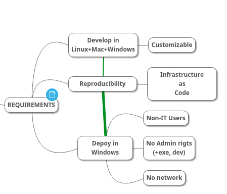

<!-- vi: set sts=4 ts=4 sw=4 : -->
# Reproducible Cross-platform python programs

## Requirements & Deliverables

Ensure a reproducible cross-platform development and deployment infrastructure-as-code,
with Vagrant images & conda packages, as...

- conceived in https://app.clickup.com/t/qgdb2
- designed: https://atlas.mindmup.com/ankostis/crossdevpython/
- The study & development for [developing and distributing a cross-platform co2mpas](https://atlas.mindmup.com/ankostis/crossdevpython/)
  included the folowing activities:
  - requirements analysis,
  - packaging methods for python & native programs (conslusion: keep existing `setup.py` but move to conda)
  - VMs for development & scriting solutions for their configurations
  - An additional EXE distribution method based on conda
- A Vagrant-script for a Virtualbox VM for Developing CO2MPAS on Windows10,
  which can be used when developing from MacOS or Linux machines
  (uploaded atm in: https://app.vagrantup.com/ankostis/boxes/co2_win10_dev).
- Cross-platform conda packages for all co2mpas dependencies that didn't have this
  (uploaded atm in: https://anaconda.org/ankostis )
- Redistributable installable co2mpas (the "EXE") for both Linux & Windows
  based on conda's `constructor` & `anaconda-navigator`.
- A new Git repo (this one) for building all of the above.

### Cross-platform development environment for CO2MPAS

> It's like a replacement for **co2mpas-ALLINONE**... but for Devs only!

- Practically it is a proof-of-concept that you can develop with Vagrant.
- Confusing when switching in-and-out of VM with `[Win-key]` - better work completely in the VM.

## Conda
- explained (3rdp slides):  http://chdoig.github.io/pydata2015-dallas-conda/

------------------

## Details

Ragarding stuff for the developers, read the REAMEs in the respective folders.

### File contents

    Vagrant/Win10/      Contains the `Vagrantfile`+scrips for the CO2MPAS development,
                        configured with:
                            + miniconda3, notepadplusplus, totalcommander, cmder, nodejs, git, docker
                            + chromium, firefox, edge (selenium-drivers)
                            + IDEs: vscode, pycharm
    conda/
        +--recipes/     folders containing `meta.yaml` files etc that build co2mpas 
        |               (or its dependent libs) as pure-conda packages, 
        |               needed for *constructor* installer.
        +--constructs/  
