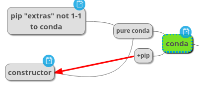

<!-- vi: set sts=4 ts=4 sw=4 : -->
# Reproducible Cross-platform python programs

## Requirements & Deliverables

Ensure a reproducible cross-platform development and deployment infrastructure-as-code,
with Vagrant images & conda packages, as...

- conceived in https://app.clickup.com/t/qgdb2
- designed: https://atlas.mindmup.com/ankostis/crossdevpython/
- The study & development for [developing and distributing a cross-platform co2mpas](https://atlas.mindmup.com/ankostis/crossdevpython/)
  included the folowing activities:
  - requirements analysis,
  - packaging methods for python & native programs (conslusion: keep existing `setup.py` but move to conda)
  - VMs for development & scriting solutions for their configurations
  - An additional EXE distribution method based on conda
- A Vagrant-script for a Virtualbox VM for Developing CO2MPAS on Windows10,
  which can be used when developing from MacOS or Linux machines
  (uploaded atm in: https://app.vagrantup.com/ankostis/boxes/co2_win10_dev).
- Cross-platform conda packages for all co2mpas dependencies that didn't have this
  (uploaded atm in: https://anaconda.org/ankostis )
- Redistributable installable co2mpas (the "EXE") for both Linux & Windows
  based on conda's `constructor` & `anaconda-navigator`.
- A new Git repo (this one) for building all of the above.

## Vagrant VM for a cross-platform dev-env

> It's like a replacement for **co2mpas-ALLINONE**... but for Devs only!

- Practically it is a proof-of-concept that you can develop with Vagrant.
- Confusing when switching in-and-out of VM with `[Win-key]` - better work completely in the VM.

## Conda

**Conda** is an extensive & flexible ecosystem, that definitely fits our corss-platform purpose, as can be seen in [this iconic presentation)[http://chdoig.github.io/pydata2015-dallas-conda/]

The ecosystem's built packages (the "recipes") are  maintained by a cohord of open-source
developers around the globe, and they are not always coherent.
In addition, there are still some open edges in the conda specification itself.
Documentation is not always present, but there is much exmaple code in the cloud.

Building the cross-platform executable, happens in 3 stages:

- select the conda packages and build any missing ones
  (that means, we must stabiizeour in-house packages before starting).
- Build an evironment andcontaining all needed packages and test that it works.
- Run the *constructor* tool and build the installation-archive.

Here are some things things to watch out for, during these 3 stages:

### **Building** python packages:

- There is a mismatch between `setup.py` managed packages in *PyPi* & conda packages
produced with `meta.yaml` recipes:

Specifically the *extras* of `setuptools` correspond to of 2-3 different conda features:

- One is [*metapackages*](https://github.com/conda/conda/issues/793),
- generated with [multiple outputs in a single `meta.yaml`](https://github.com/conda-forge/matplotlib-feedstock/issues/2).
- The more recent [*run_contrainted* `meta.yaml` keyword`](https://github.com/conda/conda/pull/4982#issuecomment-300649773) (ie. optional dependencies), and finally,
- the still unimplemented [naming of grouped dependencies](https://github.com/conda/conda/issues/7502).

Not all recipe authors know and use these features.  Consequently, some packages have
too many dependencies or missing some required ones.

- Another missmatch is that some conda packages have different *names* from *PyPi* ones
(eg. Qt packages).
This is certainly so for *metapackages*, since they do not exist in the *pip* world.

### **Installing** conda packages:

Issues here relate to the [shortcomings of the `conda` cli and the way it handles `environment.yml` files](https://github.com/conda/conda/labels/tag-environment_spec)
(a file maintainted by each conda-env).

- A rather important issue regarding **reproducibility** is that packages uploaded
  in the *conda-cloud* [do not(!) have a stable hash](https://github.com/conda/conda/issues/7882).  Their hashes may change if the package is overwwritten
  (relevant only for user-owned channels, not *conda-forge*), or when their metadata change
  in order to fix issues detected at a later time
  (eg. to [set upper boundary on an incompatible dependency](https://github.com/conda/conda/issues/4956#issuecomment-291224687)).

  Although we do not expect to bump to such issues, it's good if they are [addressed in conda-5](https://github.com/conda/conda/issues/7248).

- Porting the specs of an existing conda-environment into different platform.

### **Assembling the executable** with *constructor*

- The major issue is that it [does not support  *noarch* packages](https://github.com/conda/constructor/issues/86).
  These packages were introduced trelatively recently, and constructor is only 
[now started to catch up](https://github.com/conda/constructor/pull/256).

- While a *constructor* on linux & osx can be build executable for both these 2 platforms,
  a real *Windows* is required to build the `*.exe` file. 

------------------

## Details

Ragarding stuff for the developers, read the REAMEs in the respective folders.

## File contents

    +--Vagrant/Win10/      Contains the `Vagrantfile`+scrips for the CO2MPAS development,
    |                       configured with:
    |                           + miniconda3, git, notepad++, totalcommander, cmder, nodejs, docker
    |                           + chromium, firefox, edge (+selenium-drivers)
    |                           + IDEs: vscode, pycharm
    +--conda/
            +--recipes/     folders containing `meta.yaml` files etc that build co2mpas
            |               (or its dependent libs) as pure-conda packages,
            |               needed for *constructor* installer, currently uploaded to:
                            https://anaconda.org/ankostis 
            +--constructs/
                +--CO2MPAS  The specs for building the executable.
